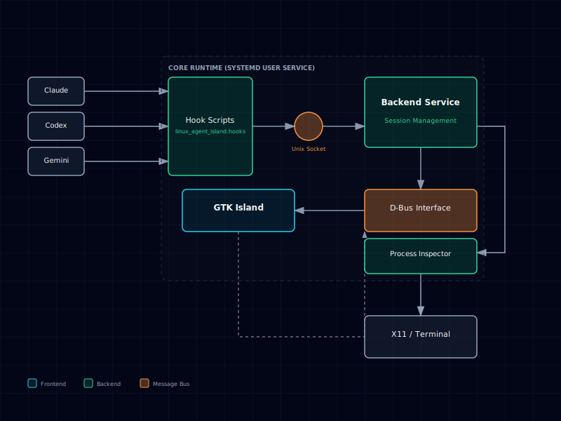

# Linux Agent Island

Linux Agent Island is an X11 desktop island for local coding agents. It tracks Claude Code, Codex CLI, and Gemini CLI sessions, shows their current state, and jumps back to the terminal that owns a session.

The app runs as a user-level service with a GTK floating panel, a D-Bus backend, managed agent hooks, an X11 global hotkey listener, and a tray menu.

Keywords: `linux agent dashboard`, `codex cli desktop widget`, `claude code session monitor`, `gemini cli session tracker`, `x11 floating panel`, `jump to terminal session`.

## Demo

The GIF below shows the island listing an existing session and jumping back to its terminal:


## Features

- Top-centered GTK4 island that can collapse to a compact session counter or expand into a session list.
- Claude Code, Codex CLI, and Gemini CLI session tracking through managed hooks plus local state restore.
- Status ordering for sessions that need attention, running sessions, and completed sessions.
- Session details with permission/question prompts, tool/context metadata, and conversation transcript previews.
- Jump-to-terminal support for direct terminal windows, tmux panes/clients, and hidden Guake windows.
- Window-local shortcuts for navigation, details, jump, highlight, mark, close, and manual running/completed toggles.
- Global `Ctrl+Alt+I` X11 hotkey that focuses the island, or minimizes it and restores the previous window when already active.
- User tray menu for show, hide, settings, and quit.
- Codex account management from CLI and settings UI: login, import, switch, rename, default, delete, usage, and credential sync.
- User-level `systemd --user` install with persistent runtime state under `~/.local/state/linux-agent-island/`.

## Architecture



Runtime layout:

1. `linux-agent-island daemon` starts four child processes: backend, frontend, global hotkey listener, and tray.
2. Agent hooks call `python -m linux_agent_island.hooks <provider> <event>` and emit normalized events to a Unix socket.
3. The backend stores sessions, restores state from provider files, reconciles live processes, and exposes D-Bus methods.
4. The frontend renders the island and calls D-Bus for session actions, transcripts, and Codex account state.
5. Process inspection uses `ps`, `pwdx`, `wmctrl`, `xdotool`, `tmux`, and optional `guake` to annotate and activate sessions.

Important D-Bus methods include `ListSessions`, `GetSessionTranscript`, `JumpToSession`, `TerminateSession`, `ToggleSessionRunning`, Codex account management methods, and `SessionsChanged` / `CodexAccountsChanged` signals.

For a detailed view, see the [interactive architecture diagram](linux-agent-island-architecture.html).

## Requirements

This project currently targets X11. Wayland is not supported.

Ubuntu/Debian packages:

```bash
sudo apt update
sudo apt install -y \
  python3 python3-venv python3-gi python3-xlib \
  gir1.2-gtk-4.0 gir1.2-gdkx11-4.0 gir1.2-gtk-3.0 gir1.2-ayatanaappindicator3-0.1 \
  wmctrl x11-utils xdotool libglib2.0-bin procps
```

Optional tools:

- `tmux`: needed for tmux pane/client selection.
- `guake`: needed only if you want hidden Guake windows to be revealed before activation.
- Node-based CLIs such as `codex` and `openclaw`: used by Codex login/usage/sync workflows.

## Install

```bash
git clone <repo-url> linux-agent-island
cd linux-agent-island
./scripts/install-user-app.sh
systemctl --user start linux-agent-island.service
```

The installer creates:

```text
~/.local/share/linux-agent-island/venv
~/.local/bin/linux-agent-island
~/.local/bin/lai
~/.config/systemd/user/linux-agent-island.service
~/.local/share/applications/linux-agent-island.desktop
~/.local/share/icons/hicolor/scalable/apps/linux-agent-island.svg
```

It also enables the user service, installs managed hooks, and points installed hooks at the installed venv. The installed app runs from `~/.local/share/linux-agent-island/venv`, so it does not depend on the source checkout after installation.

## CLI

`lai` is a short alias for `linux-agent-island`; every command works with either name.

```bash
lai open
lai toggle
lai settings
lai status

linux-agent-island daemon --log-level INFO
linux-agent-island open
linux-agent-island toggle
linux-agent-island settings
linux-agent-island highlight-selected
linux-agent-island status
linux-agent-island install-hooks
linux-agent-island uninstall-hooks

linux-agent-island codex login --label Work
linux-agent-island codex status
linux-agent-island codex usage
linux-agent-island codex usage <account>
linux-agent-island codex usage --all
linux-agent-island codex sync-auth <account>
linux-agent-island codex sync-auth --email <email>
linux-agent-island codex accounts list
linux-agent-island codex accounts switch <account>
linux-agent-island codex accounts switch <account> -s
linux-agent-island codex accounts rename <account-id> <label>
linux-agent-island codex accounts set-default <account-id>
linux-agent-island codex accounts delete <account-id>
linux-agent-island codex accounts import-current --label Work
```

Codex account selectors accept account number, account ID, label, or email where the command supports selectors. `codex accounts switch <account> -s` switches the active account and then syncs that account's credentials to OpenClaw and Hermes.

The legacy flat command `linux-agent-island codex-login` still exists for compatibility, but it prints a deprecation warning. Use `linux-agent-island codex login` instead.

## Keyboard Shortcuts

- Global `Ctrl+Alt+I`: focus the island; if the island is already active, minimize it and restore the previous X11 window.
- Window-local `?`: show the shortcut help panel; press `?` or `Esc` to close it.
- Window-local `Up` / `Down`: move the selected session row.
- Window-local `Enter`: expand the selected session row.
- Window-local `Shift+Enter`: open the selected session terminal.
- Window-local `Ctrl+H`: toggle highlight on the selected session row.
- Window-local `m`: mark or unmark the selected session row for batch close.
- Window-local `r`: set the selected session row to running; if it is already running, set it to completed.
- Window-local `x`: close marked session processes, or the selected session when nothing is marked.

## Settings

Open the settings window with:

```bash
lai settings
```

The UI exposes:

- `top_bar_gap`: vertical gap below the top work area.
- `log_level`: daemon/frontend/backend/hook log level after restart.
- `start_on_login`: maps to `systemctl --user enable/disable linux-agent-island.service`.
- `node_bin_dir`: optional directory used to resolve Node-based CLIs like `codex` and `openclaw` before falling back to `PATH`.
- Codex account controls: connect, rename, use, set default, and delete.

Settings are stored at:

```text
~/.config/linux-agent-island/settings.json
```

The settings loader also supports a manually written `codex_bin_path` field for selecting a specific Codex executable.

## Managed Hooks

The backend installs or refreshes managed hooks at startup. `install-hooks` and `uninstall-hooks` run the same provider hook management manually.

Managed config files:

```text
~/.claude/settings.json
~/.codex/hooks.json
~/.gemini/settings.json
```

Managed events:

- Claude: `UserPromptSubmit`, `PreToolUse`, `PostToolUse`, `PermissionRequest`, `Notification`, `Stop`, `SessionStart`, `SessionEnd`, `PreCompact`.
- Codex: `SessionStart`, `UserPromptSubmit`, `Stop`; older Linux Agent Island-managed `PreToolUse` / `PostToolUse` entries are pruned.
- Gemini: `SessionStart`, `BeforeAgent`, `AfterAgent`, `SessionEnd`, `Notification`.

User-defined hooks are preserved. Managed hooks are detected and pruned by module command shape, so old Linux Agent Island source-path hooks can be replaced safely.

## Runtime Files

Runtime state:

```text
~/.local/state/linux-agent-island/
~/.local/state/linux-agent-island/sessions.json
~/.local/state/linux-agent-island/events.sock
~/.local/state/linux-agent-island/logs/daemon.log
~/.local/state/linux-agent-island/logs/backend.log
~/.local/state/linux-agent-island/logs/frontend.log
~/.local/state/linux-agent-island/logs/hotkeys.log
~/.local/state/linux-agent-island/logs/tray.log
~/.local/state/linux-agent-island/logs/hooks.log
```

Codex account state:

```text
~/.codex/auth.json
~/.config/linux-agent-island/codex-accounts/accounts.json
~/.config/linux-agent-island/codex-accounts/*.json
~/.config/linux-agent-island/codex-accounts/usage-cache/
```

`codex sync-auth` writes compatible credentials for OpenClaw and Hermes, then tries `openclaw secrets reload --json` when `openclaw` is available.

## Service Commands

```bash
systemctl --user start linux-agent-island.service
systemctl --user restart linux-agent-island.service
systemctl --user stop linux-agent-island.service
systemctl --user status linux-agent-island.service --no-pager
journalctl --user -u linux-agent-island.service -f
```

If the service starts without desktop access, run this once from a terminal inside your graphical session:

```bash
systemctl --user import-environment DISPLAY XAUTHORITY DBUS_SESSION_BUS_ADDRESS XDG_CURRENT_DESKTOP XDG_RUNTIME_DIR
dbus-update-activation-environment --systemd DISPLAY XAUTHORITY DBUS_SESSION_BUS_ADDRESS XDG_CURRENT_DESKTOP XDG_RUNTIME_DIR
```

## Upgrade

From a newer checkout:

```bash
git pull
./scripts/install-user-app.sh
systemctl --user restart linux-agent-island.service
```

The install script is safe to run again; it refreshes the venv, CLI wrappers, service, desktop launcher, icon, and managed hooks.

## Development

Run backend and frontend directly from the checkout:

```bash
./scripts/run-dev.sh
./scripts/run-dev.sh --log-level DEBUG
```

The development runner sets:

```bash
LINUX_AGENT_ISLAND_HOOK_COMMAND_PREFIX="PYTHONPATH=<repo> /usr/bin/python3 -m linux_agent_island.hooks"
```

That makes hook events use the working tree during development. Restore installed hook commands afterward with:

```bash
linux-agent-island install-hooks
```

Run tests:

```bash
PYTHONDONTWRITEBYTECODE=1 /usr/bin/python3 -m pytest -q
```

## More Details

- [Desktop app, service, hooks, and files](docs/desktop-app.md)
- [Historical design notes](docs/superpowers/)

## FAQ

### Does this support Wayland?

No. Current support is X11 only.

### Which agents are supported?

Claude Code, Codex CLI, and Gemini CLI.

### Can I jump from the island to the exact terminal session?

Usually, yes. The app can activate direct terminal windows, select tmux windows/panes through an attached or external client, and reveal Guake before activation when Guake owns the target session.

### Can the island stop an agent process?

Yes. Press `x` on the selected row, or mark rows with `m` and press `x`. The backend validates the stored PID against the provider and working directory before sending `SIGTERM`.

### Why does switching a Codex account not affect an already running Codex session?

Codex account switching replaces the active `~/.codex/auth.json` and affects new Codex sessions. Existing sessions keep the credentials they already loaded.
