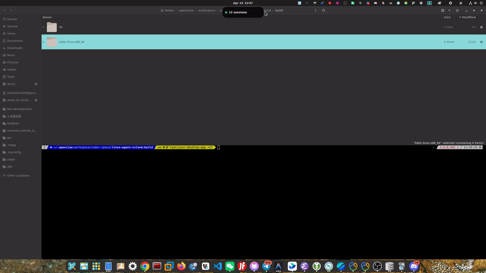

# Linux Agent Island

Linux Agent Island is a small X11 desktop island for local coding agents. It shows active Claude Code, Codex CLI, and Gemini CLI sessions, keeps state in a background service, and can jump back to the terminal that owns a session.

Keywords: `linux agent dashboard`, `codex cli desktop widget`, `claude code session monitor`, `gemini cli session tracker`, `x11 floating panel`, `jump to terminal session`.

## Demo

The GIF below shows the island listing an existing session and jumping back to its terminal:



## What It Solves

- Track active local AI coding agent sessions in one always-on-top island.
- See Claude Code, Codex CLI, and Gemini CLI status without switching terminals.
- Jump directly to the terminal window that owns a session.
- Keep session state in a background service so the UI can be reopened instantly.

## Features

- X11 floating island UI for local agent sessions.
- User-level `systemd --user` service for persistent backend/frontend lifecycle.
- D-Bus powered controls (`open`, `settings`, `status`, jump-to-session).
- Hook-based ingestion for Claude/Codex/Gemini events.
- Session restore and process reconciliation after restart.

## Requirements

Ubuntu/Debian:

```bash
sudo apt update
sudo apt install -y python3 python3-venv python3-gi gir1.2-gtk-4.0 gir1.2-gdkx11-4.0 gir1.2-ayatanaappindicator3-0.1 wmctrl x11-utils libglib2.0-bin
```

You also need an X11 desktop session. Wayland is not supported yet.

## Install

```bash
git clone <repo-url> linux-agent-island
cd linux-agent-island
./scripts/install-user-app.sh
systemctl --user start linux-agent-island.service
```

The installer creates a user-level desktop app, a `systemd --user` service, and the `linux-agent-island` CLI. The installed app runs from `~/.local/share/linux-agent-island/venv`, so it does not depend on the source checkout after installation.

## Use

```bash
linux-agent-island open       # show the island
linux-agent-island settings   # open settings
linux-agent-island status     # service and D-Bus status
```

Useful service commands:

```bash
systemctl --user restart linux-agent-island.service
systemctl --user stop linux-agent-island.service
journalctl --user -u linux-agent-island.service -f
```

If the service starts without desktop access, run this once from a terminal inside your graphical session:

```bash
systemctl --user import-environment DISPLAY XAUTHORITY DBUS_SESSION_BUS_ADDRESS XDG_CURRENT_DESKTOP
dbus-update-activation-environment --systemd DISPLAY XAUTHORITY DBUS_SESSION_BUS_ADDRESS XDG_CURRENT_DESKTOP
```

## Upgrade

From a newer checkout:

```bash
git pull
./scripts/install-user-app.sh
systemctl --user restart linux-agent-island.service
```

The install script is safe to run again; it refreshes the venv, service, desktop launcher, icon, and managed hooks.

## Development

Run directly from the checkout:

```bash
./scripts/run-dev.sh
./scripts/run-dev.sh --log-level DEBUG
```

The development runner points managed hook commands at the current checkout. After development, restore installed hook commands with:

```bash
linux-agent-island install-hooks
```

Run tests:

```bash
PYTHONDONTWRITEBYTECODE=1 /usr/bin/python3 -m pytest -q
```

## More Details

- [Desktop app, service, hooks, and files](docs/desktop-app.md)
- [Historical design notes](docs/superpowers/)

## FAQ

### Does this support Wayland?

Not yet. Current support is X11 only.

### Which agents are supported?

Claude Code, Codex CLI, and Gemini CLI.

### Can I jump from the island to the exact terminal session?

Yes. Use the jump button on a session card; the app focuses the matched terminal window when available.

### Where are logs and runtime files stored?

Under `~/.local/state/linux-agent-island/` (including `logs/` and `sessions.json`).
